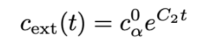
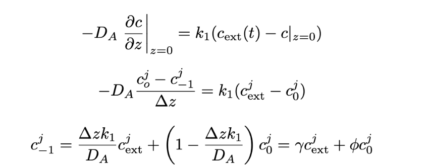
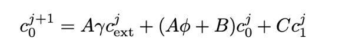
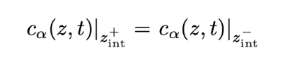
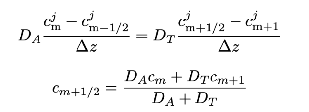
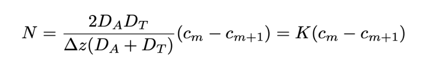
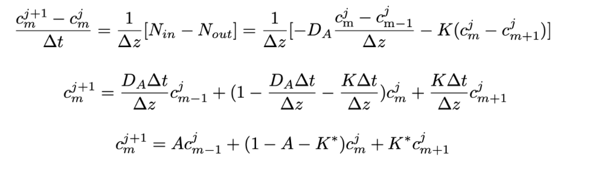
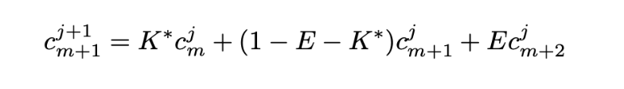
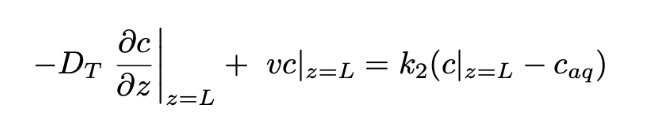
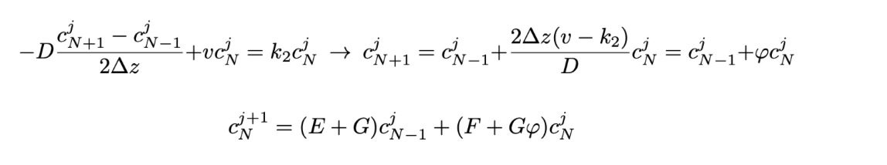

# proyecto_fenomenos_grupo11

## Descripción general del proyecto

El presente proyecto aborda la modelación del transporte de lixiviados a través de barreras semipermeables en un Relleno Sanitario.

Los derrames de lixiviados producidos por desechos que no son tratados óptimamente, provocan impactos graves en el medioambiente que tienen graves consecuencias sociales y económicas, y Chile no está exento de esta problemática.

Es por esto que surge la necesidad de fortalecer los suelos de los rellenos sanitarios donde se disponen finalmente los residuos sólidos con capas permeables que eviten el transporte de lixiviados.

En Chile, debido a los grandes problemas que provoca la deposición de lixiviados en los suelos, existen normas que regulan esta actividad, tales como la Ley 19300, que establece que todos los proyectos de saneamiento ambiental deben someterse al sistema de evaluación de impacto ambiental, y el Decreto Supremo N°46/2002, que tiene por objeto regular la descarga de contaminantes hacia aguas subterráneas, mediante la fijación de límites máximos permisibles para la descarga de residuos líquidos.

## Explicación breve sistema modelado

Para llevar a cabo la modelación del transporte, se consideró un sistema compuesto por tres capas: HDPE, arcilla compacta y tierra franco-arenosa; y se consideraron dos contaminantes: CLoruro y Nitrato. Para esto, se modeló un sistema cartesiano unidireccional con simetría del perfil de concentración en el plano horizontal, utilizando los siguientes supuestos:

**I.** Se excluyen del estudio los fenómenos de transferencia producidos en las paredes laterales del relleno sanitario.

**II.** El ancho de las capas del sistema es igual al mínimo establecido por la normativa chilena.

**III.** Debido al bajo espesor de la geomembrana, sus efectos se modelan como una condición de borde.

**IV.** El dominio del sistema empieza desde la superficie externa de la capa de arcilla compactada, que cuenta con un ancho mínimo de 60 cm y termina con una capa de tierra de 3 m.

**V.** Debido a la muy baja conductividad hidráulica del HDPE y la arcilla compactada, se considera que no existe transporte advectivo en estos materiales. En las capas inferiores, se asume que el término advectivo no es despreciable.

**VI.** Los contaminantes no reaccionan en el medio en que se transportan pero se incorpora término de decaimiento exponencial en el tiempo en la superficie externa de la geomembrana. Esto representa reacciones o descomposiciones que ocurren en el lixiviado acumulado antes de entrar en las capas del suelo.

**VII.** Propiedades físicas como el coeficiente de difusividad en un material son constantes en el espacio y en el tiempo. Se utilizarán valores reportados en la literatura asumiendo que son aplicables para el contexto del modelo.

**VIII.** Se desprecian los efectos de retención de solutos mediante adsorción y retención de agua. También se asume un sistema isotérmico y no se consideran efectos térmicos en la transferencia de materia. No se consideran fluctuaciones fluviales.

**IX.** Se desprecian las posibles interacciones entre contaminantes en el proceso de transferencia de masa, tales como competencia por sitios de sorción, reacciones y fenómenos de difusión cruzada.

La siguiente imagen representa el sistema modelado:

  

## Descripción del método numérico utilizado
Luego de realizar el balance de materia de un compuesto α en un volumen diferencial rectangular en una capa del sistema, se llegó a la siguiente ecuación gobernante:

  

Además, debido a los supuestos considerados, se hace la distinción para las capas de arcilla y tierra. Por lo que para cada una se obtienen las siguientes ecuaciones gobernantes:

### Ecuación barrera de arcilla:

  

### Ecuación capa natural de tierra:

  

De este modo,  las ecuaciones gobernantes para las capas corresponden a un balance de masa diferencial (transiente y 1-D) que considera transporte de los contaminantes sólo por difusión en la barrera de arcilla y además el arrastre advectivo en la capa de suelo.

En cuanto a las discretizaciones realizadas, se discretizó la ecuación gobernante de la barrera de arcilla para un contaminante dado (con su respectiva difusividad) mediante el método Forward Time-Centered Space (FTCS), lo cual se puede ver en la siguiente imagen:

  

Junto a esto, se discretizó la capa de tierra de la siguiente forma:

  

Además, se consideraron las siguientes condiciones inicialesw y de borde:

**1.Condiciones iniciales en el tiempo:** Inicialmente (en t = 0), no hay contaminantes dentro del sistema de contención.

  

**2.Cambio de concentración temporal en borde espacial superior:** De acuerdo a los supuestos considerados, sí existe contaminante listo para ingresar al otro lado de la geomembrana, y su concentración cambia con el tiempo.

  

**3.Flujo de entrada a través de geomembrana:** El flujo difusivo de contaminante en el límite superior del dominio se iguala a un término proporcional a la diferencia de concentraciones entre el lixiviado y el primer nodo del suelo. Esta formulación representa el transporte a través de la geomembrana sin necesidad de discretizar su espesor.

  

Insertando este nodo fantasma en la ecuación gobernante:

  

El valor del coeficiente de transferencia asumido para ambos compuestos fue de  2.0×10-12 (m×s-1)

**4.Continuidad de concentraciones:** La concentración del contaminante es idéntica justo a un lado y al otro de la separación entre dos materiales; no hay "saltos" bruscos de concentración en el punto.

  

**5.Continuidad del flujo dispersivo:** Sea cm la concentración asociada al último nodo de la capa de arcilla, cm+1 la concentración asociada al primer nodo de la capa de tierra  y cm+1/2  la concentración en la cara entre ambos, el flujo asociado a esta cara por la condición de continuidad cumple: 

  

Si este término se reemplaza en la definición del flujo de la cara, se obtiene:

  

Considerando este flujo en la ecuación gobernante para la concentración cm, se obtiene:

  

Con una derivación similar para cm+1 se obtiene:

  

**6.Flujo de salida:** Se representa un flujo de salida del contaminante hacia la napa, gobernado por difusión y advección en el suelo, y controlado por una transferencia al agua subterránea proporcional al gradiente de concentración en la interfaz.

  

Asumiendo que la concentración del contaminante en el seno del fluido (caq) es despreciable, la discretización y definición de concentración en el último nodo es:

  

El valor del coeficiente de transferencia asumido para el cloruro y nitrato fue de  5.0×10-7 (m×s-1).

